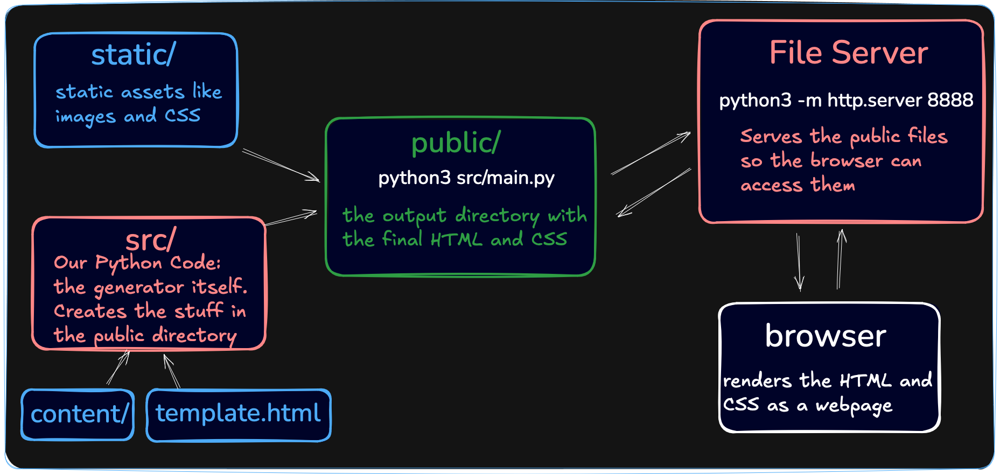

# Static site generator

Guided project from [boot.dev](https://www.boot.dev), an web app dedicated to back-end development learning.

## Description
### Build a static site generator from scratch, similar to Jekyll, Hugo, or Gatsby in Python.

Ever wondered how SEO and performance-optimized static site generators like Hugo work? In this guided project you'll build your own from scratch using Python. You'll put a lot of your learnings from Object-Oriented Programming and Functional Programming to use in a tangible web project. This project isn't for the faint of heart, but it's well worth the effort. You'll come away with a deeper understanding of static content management.

[Link to the course ](https://www.boot.dev/courses/build-static-site-generator)

## Architecture

The flow of data through the full system is:

1. Markdown files are in the /content directory. A template.html file is in the root of the project.

2. The static site generator (the Python code in src/) reads the Markdown files and the template file.

3. The generator converts the Markdown files to a final HTML file for each page and writes them to the /public directory.

4. We start the built-in Python HTTP server (a separate program, unrelated to the generator) to serve the contents of the /public directory on http://localhost:8888 (our local machine).

5. We open a browser and navigate to http://localhost:8888 to view the rendered site.